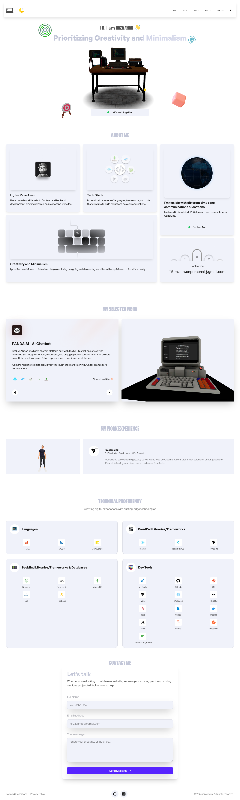

# TheProfolio - 3D Portfolio Website

## 📋 Table of Contents

1. 🔗 [Live Demo](#livedemo)
2. 📱 [Features](#features)
3. ⚙️ [Tech Stack](#tech-stack)
4. 🚀 [Installation](#installation)
5. 🛠️ [Environment Setup](#env)

## <a name='livedemo'>[🔗LiveDemo](https://razaawan.up.railway.app/) </a>


## <a name="features">📱 Features</a>

- Interactive 3D Graphics with Three.js
- Smooth Animations with GSAP
- Email Integration with EmailJS
- Responsive Design
- Interactive Globe Visualization
- Motion Graphics with Framer Motion
- Lottie Animations
- Spring Physics Animations
- Custom 3D Models and Scenes

## <a name="tech-stack">⚙️ Tech Stack</a>

Core:
- React 18
- Vite
- TailwindCSS
- Three.js
- Figma
- Docker

3D & Animation:
- React Three Fiber
- React Three Drei
- GSAP
- Framer Motion
- React Spring
- Lottie React
- React Globe.gl

Utilities:
- EmailJS
- React Icons
- React Responsive
- React Use
- Lodash
- Clsx

Development Tools:
- ESLint
- Prettier
- PostCSS
- Autoprefixer

## <a name="installation">🚀 Installation</a>

1. Clone and Install:
```bash
git clone https://github.com/yourusername/theprofolio.git
cd theprofolio
npm install
